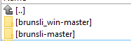
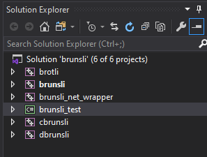
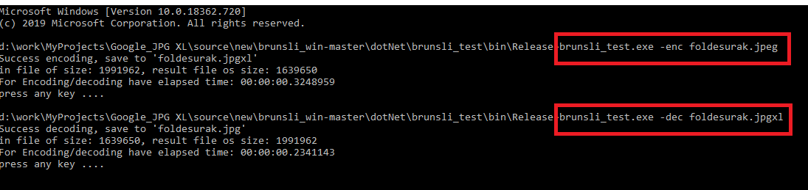

### Introduction

Brunsli project is from Google.  This project is compiled in MSVC C and C#.

[Google brunsli](https://github.com/google/brunsli)

 

Microsoft Visual Studio C++, C# 2019: 
Platform toolset version: v142 
Windows SDK version C/C++: 10.0 latest installed version 
C# target framework: .NET Framework 4.7.2 
#### Dependencies:
1.) download  [Google brunsli](https://github.com/google/brunsli) 
2.) you check that, the brunsli project have brotli project in .\brunsli-master\third_party\brotli\  
3.) download this project. 
JUST SO GOOD: 

 

#### Build instructions:
1.) Start Visual Studio 2019 
2.) Open Solution (sln): ./c/brunsli.sln :  

 

3.) F7 build solution 
##### Result, if the success compiled:  
###### C: 
brunsli.dll : .\c\x64\Release\  
brunsli.lib static : .\c\x64\Release\  
brotli.lib  static :  .\c\x64\Release\  
cbrunsli.exe : .\c\cbrunsli\x64\Release\  
dbrunsli.exe : .\c\dbrunsli\x64\Release\  
###### C#: 
brunsli_net_wrapper.dll : \dotNet\brunsli_net_wrapper\x64\Release\  
brunsli_test.exe : \dotNet\brunsli_test\bin\Release\  

 
